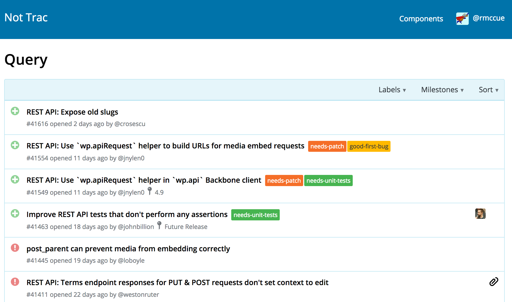
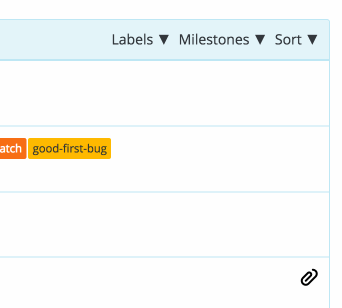
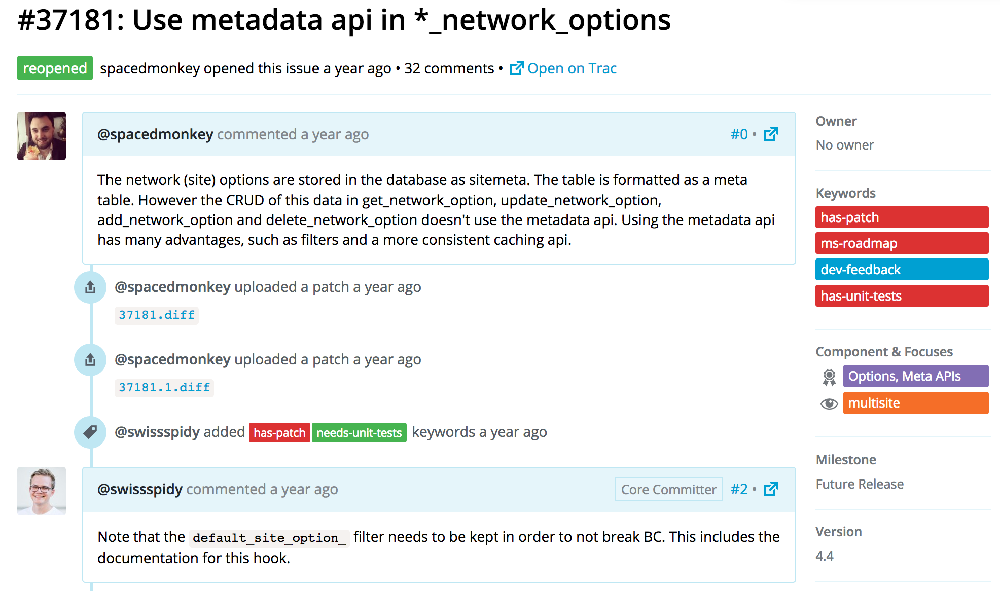
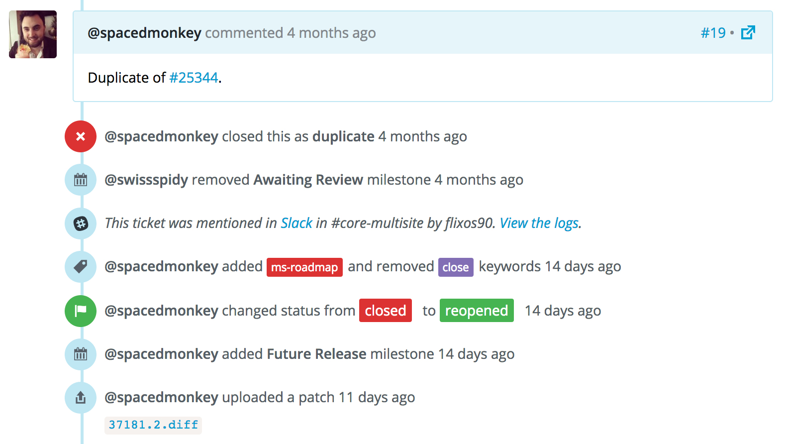
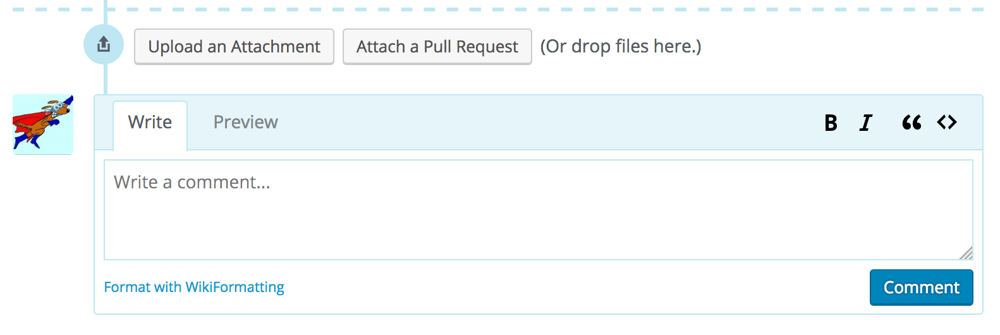
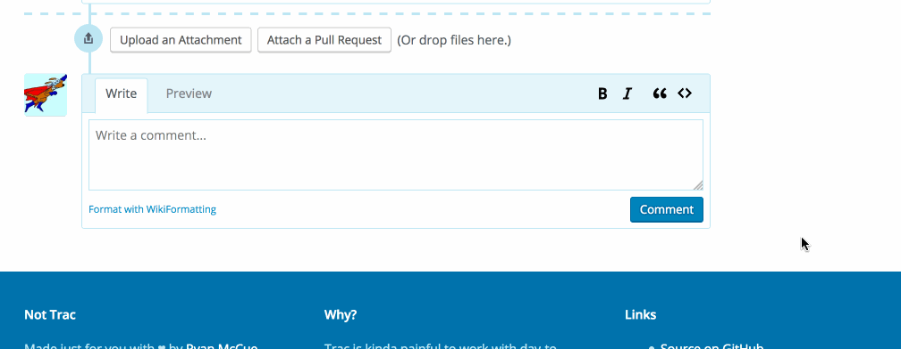

# Not Trac

This project isn't Trac.

## Disclaimer

This connects to WordPress.org's Trac instance via XML-RPC, and hence requires your username and password. You shouldn't trust my code, and you should carefully audit all code that handles your username and password before entering it into this application.

This especially applies if you're a committer. Your WordPress.org password controls your commit access to 28% of the web, be extremely cautious with it.

**THERE IS ZERO SUPPORT PROVIDED FOR THIS INTERFACE**. This is something I made for my own use. If it's useful to you, great; if not, also great.

## Features

Not Trac is a React app built from the ground up for me. I hate waiting around for slow things, and I want lots of information at a glance. You might find it useful too.

### Query, then filter and sort

View the list of tickets and their status, and browse with fast pagination.



Filter by component, label, and milestone, and re-sort in a snap.




### See important changes at a glance

The ticket header and summary give you the rundown on tickets at first glance.



The ticket timeline view highlights important events.




### Comment with instant previews

Leave a comment just like you would on Trac, and preview it instantly (no round-trip to the server).




### Upload attachments, or use pull requests

Upload attachments just like you would on Trac.


First-class pull request support is available, freeing up your time to work on the important things.




## Running Locally

```sh
# Clone
git clone https://github.com/rmccue/not-trac.git
cd not-trac

# Install all dependencies:
npm install
cd proxy
composer install
cd ..

# Run the following two simultaneously (maybe in separate terminal sessions):
npm run start
cd proxy && php -S 0.0.0.0:3001
```

## License

Uh... ISC I guess?
